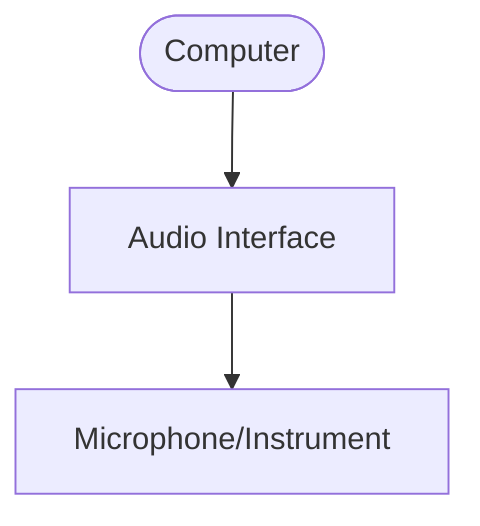
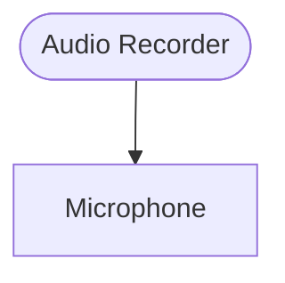
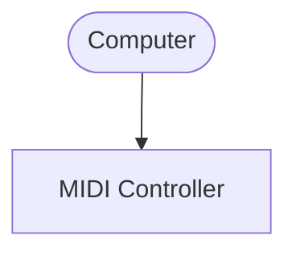

# INFR 2370U: Game Sound Tutorial
![[giphy 1.gif]]
# 'Mini Talk: Background Info'

## We will begin shortly
Presented by Constantine Lucius Pallas for Ontario Tech University, Thursday September 11, 2025

---
# Key Takeaway
## After this presentation, you will:

1. **Understand the purpose and functionality of key tools (DAW, Audio Editor, VST instruments/Effects)**<!-- element class="fragment" -->
2. **Understand that you don't need to spend much/anything to make good music**<!-- element class="fragment" -->
3. **Be able to make somewhat more informed tool selections**<!-- element class="fragment" -->
---
# Software
---
# DAWs
![[Pasted image 20250911015216.png]]
## Software designed for recording and editing music
### Interface Designed to work with multiple tracks/instruments at the same time
---
# DAWs
<split even gap="1">
![[Pasted image 20250911014335.png|200]]
![[FL_Studio_2024.webp|200]]!
![[Pasted image 20250911014532.jpg|200]]!
![[Pasted image 20250911014618.png|200]]!
</split>

### Reaper, FL Studio, Cakewalk SONAR, Logic Pro
#### There are many more, do some research to find one that fits your needs
---
# Audio Editor
![[Pasted image 20250911030651.png]]

## Software designed for recording and editing sound files
### Interface Designed to work with one track* at a time
---
# Audio Editors
<split even gap="1">
![[Pasted image 20250911030935.png|200]]
![[Pasted image 20250911030951.png|200]]
</split>

#### You get Audition through the Adobe student bundle... but you should probably just use Audacity

---
# VST Instruments

<split even gap="1">
![[Pasted image 20250911015618.png|300]]!
![[Pasted image 20250911015632.png|300]]!
</split>
<split even gap="1">
![[Pasted image 20250911015956.png|300]]!
![[Pasted image 20250911020054.png|300]]!
</split>

## Applications that generate audio (usually from MIDI input) 

---
# VST Effects
<split even gap="1">
![[Pasted image 20250911020601.png|300]]!
![[Pasted image 20250911020703.png|300]]!
</split>
<split even gap="1">
![[Pasted image 20250911021103.png|300]]!
![[Pasted image 20250911021218.png|300]]!
</split>

## Applications that *modify* audio
#### If a VST Instrument is analogous to a guitar, a VST Effect is like a guitar pedal. 
---
# Hardware

---
# Computer
![[Pasted image 20250911021455.png]]

---
# Microphone

<split even gap="1">
![[Pasted image 20250911022159.png|200]]
![[Pasted image 20250911021713.png|200]]!
![[Pasted image 20250911021915.png|200]]!
![[Pasted image 20250911022128.png|200]]!
</split>

### There are many types of microphones - You'll have a whole lecture on the differences 

---
# Audio Interface
<split even gap="1">
![[Pasted image 20250911023101.png|300]]
![[Pasted image 20250911022709.png|300]]!
</split>

<split even gap="1">
![[Pasted image 20250911022546.png|300]]!
![[Pasted image 20250911023143.png|300]]
</split>

## A device that powers and connects analog audio devices (i.e. microphones, musical instruments, and headphones) to a computer
---
# Audio Recorder
![[Pasted image 20250911024023.png|300]]
## A portable device used to record audio
---
# MIDI Controller
<split even gap="1">
![[Pasted image 20250911024212.png|300]]
![[Pasted image 20250911024239.png|300]]
</split>
<split even gap="1">
![[Pasted image 20250911024322.png|300]]
![[Pasted image 20250911024408.png|300]]
</split>

## A physical controller for VST instruments

---
# Setups
<split even gap="1">

</split>
<split even gap="1">

**Great for live 
vocals / instruments**

**Great for Sound
Effects and Foley**

**Great for controlling 
VST instruments**
</split>

---
# Great News
## All of the hardware discussed can be tried, used, and in some cases even borrowed from the Game Lab 
---
# Comparing Hardware
[Spreadsheet of every hardware product pictured](https://docs.google.com/spreadsheets/d/1Z714f_zC1gQMLB873e_6DqiNZXeNFU_Y6AP7R2TRZqc/edit?usp=sharing)

---
# Demo
### Let's set up a DAW