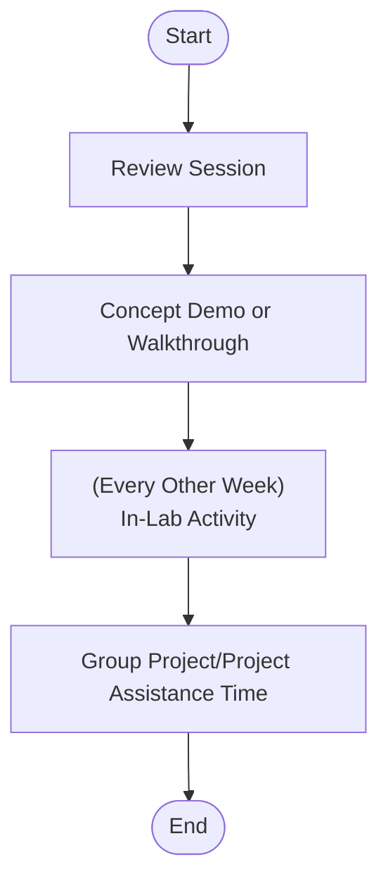

# INFR 3110U: Game Engine Design Tutorial (Week 2)
## We will begin shortly
![[giphy.gif]]
Presented by Constantine Lucius Pallas for Ontario Tech University, Thursday September 11, 2025

---
# So... who is this guy? 
<split even gap=3>
![[Pasted image 20250910211644.png|500]]
- Constantine Lucius Pallas (Just call me Constantine, I'm younger than some of you) <!-- element class="fragment" -->
- 2025 Graduate of Ontario Tech Game Development and Interactive Media Program <!-- element class="fragment" -->
- Graduate Student (Master's Computer Science, Digital Media) <!-- element class="fragment" -->
- Complete Nerd <!-- element class="fragment" -->
</split>
---
# How to succeed in this class

### 1. Do the Asynchronous Content <!-- element class="fragment" -->
### 2. Be sure to submit assignments before the deadline  <!-- element class="fragment" -->
### 3. Use the assignments as an opportunity to make your GDW game better <!-- element class="fragment" -->
### 4. Make note of how these techniques can make you a better developer<!-- element class="fragment" -->

---
# How will these tutorials work?

---

# Lab Evaluations
### Format: Create and share a small interactive project demonstrating understanding of the related topic(s) <!-- element class="fragment" -->
### Guidelines and requirements will be posted during labs <!-- element class="fragment" -->
### Lab Evaluations will take place every two weeks, starting next week <!-- element class="fragment" -->
### You will be given time during the lab to complete these tasks <!-- element class="fragment" -->

---
# Mind Map: Why you took this course
![[Pasted image 20250912120808.png]]
---
# What you can expect to get from this course

### 1. Not actually about creating engines, Focus on effectively using and extending existing engines <!-- element class="fragment" -->
### 2. Primary focus: Useful programming patterns <!-- element class="fragment" -->
#### Singleton, Factory, Observer, Command<!-- element class="fragment" -->
### 3. Secondary focus: Improving development skills <!-- element class="fragment" -->
#### Code Planning/Structure, Version Control, and Optimization<!-- element class="fragment" -->
---
# Questions for the class
### Which course topics do you want extra support with?<!-- element class="fragment" -->
### What game engines are you using (for GDW and otherwise)<!-- element class="fragment" -->

### Which engines do you want to see demos and examples for?<!-- element class="fragment" -->

---
## Choosing an Engine (Opinionated)
![[Pasted image 20250912122546.png]]
---
# Demo: Documentation and Diagrams
#### Note-Taking/Documentation
[Notion](https://www.notion.com/)

[Obsidian](https://obsidian.md/)

#### Code Planning
[Obsidian](https://obsidian.md/)

[Mermaid](https://www.mermaidchart.com/)

[Star UML](https://staruml.io/)

---
# Demo: Repositories and Project Configuration

#### Version Control
[GitHub](https://github.com/)
[GitLab](https://about.gitlab.com/)

---
# Team Support Time
### If you do not already have a project group, consider taking this time to form one.

---
# End of Lab Content for Today
#### Be good to each other!