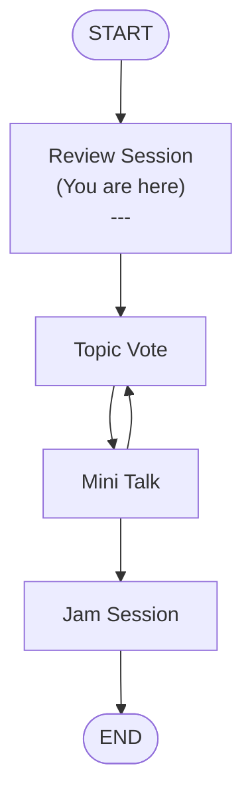

---
theme:
---

# INFR 2370U: Game Sound Tutorial
# 'Introduction'
![[giphy.gif]]
## We will begin shortly
Presented by Constantine Lucius Pallas for Ontario Tech University, Thursday September 11, 2025

---
# So... who is this guy? 
<split even gap=3>
![[Pasted image 20250910211644.png|300]]
- Constantine Lucius Pallas (Just call me Constantine, I'm younger than some of you) <!-- element class="fragment" -->
- 2025 Graduate of Ontario Tech Game Development and Interactive Media Program <!-- element class="fragment" -->
- Graduate Student (Master's Computer Science, Digital Media) <!-- element class="fragment" -->
- Complete Nerd <!-- element class="fragment" -->
</split>

---
# Key Note
### How to Succeed in this class*
#### ==*If you want to get the most out of it==<!-- element class="fragment" -->

---
1. **Read the rubrics** <!-- element class="fragment" -->
2. **Don't not care**<!-- element class="fragment" -->
3. **Create compulsively**<!-- element class="fragment" -->
4. **Make Decisions** <!-- element class="fragment" -->
---
# How will the tutorials go?

---
# Review Session
### That's what we're doing now
1. Discuss previous lecture topic <!-- element class="fragment" -->
2. Answer any questions from previous lecture <!-- element class="fragment" -->
3. Discuss anything relevant to the tutorials  <!-- element class="fragment" -->

---
# Tutorial Discussion Topics for Today:
### ==Should these tutorials be recorded and uploaded (unlisted) to YouTube?==<!-- element class="fragment" -->
### ==What do you think about the background music?==<!-- element class="fragment" -->
### ==Discuss future Mini Talk Topics, Share Voting Link==<!-- element class="fragment" -->
![[Pasted image 20250911013310.png]] <!-- element class="fragment" -->
---
# End of Review Session. Up Next:
## Mini Talk: Background Info