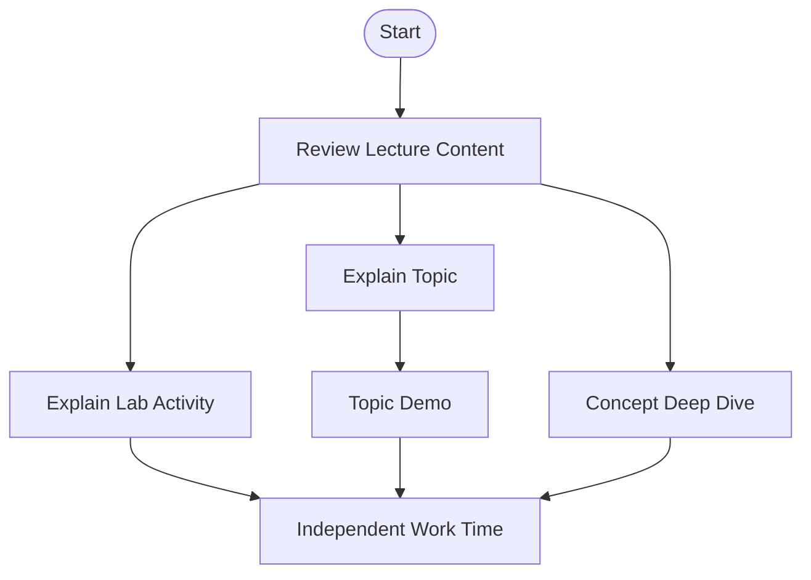

# INFR 3380U 
### Industrial Design for Game Hardware

### Tutorial 1 (introduction)
### We will begin shortly.
#### Tutorial Presented by Constantine Pallas

---
# So... who is this guy? 
<split even gap=3>
![[Pasted image 20250910211644.png|500]]
- ## Constantine Lucius Pallas <!-- element class="fragment" -->
- ## Current Masters CS Student <!-- element class="fragment" -->
- ## Recent Game Dev Grad <!-- element class="fragment" -->
- ## Took this course last year <!-- element class="fragment" -->
 -</split>
 If you need to get ahold of me, you can message me on Canvas or Discord. I will likely respond quicker on Discord. <!-- element class="`fragment" -->
 
---
# Course Thesis
## Build cool things

---
# What will you learn in this class?

## Basics of input device prototyping
### - Ideation, Circuitry, Building, Programming, Testing   
## Basics of academic experimentation and writing

---
# To be more specific
## Ideation
## Circuit Design and Microcontrollers
## Computer Aided Design
## Design for Manufacturing (Tailored to 3D Printing)
## Physical prototyping
## Microcontroller Programming
## Custom HID Integration In-Engine 
## Usability Testing
## Writing an IEEE-style Paper

---
# How will these labs go?

---

# Two ways to approach this class

---

# How you *could* do it
## Complete all assignments to minimum specifications
## Memorize terms and learn procedures only as necessary
## Write a paper with irrelevant references, pad to fill word count
## Give a presentation that makes the above obvious

---

# How you *should* do it

## Start early - quickly ideate and form a plan
## Design iteratively
## Learn by doing
## Approach research with a real question or goal in mind
## Give a presentation that makes the above obvious

---

# Tools
## We will use specific software during the labs. You can use whichever software you prefer, but I will be able to provide greater assistance if you closely follow my setup.

## Circuit Design: KiCad 9
## 3D Design: Blender, Fusion360
## 2D Design:  Affinity
## IDE: Visual Studio Code
## Firmware Base: ZMK
## Version Control: GitHub
## Compilation Platform: GitHub Actions
## Soldering Iron, Unleaded Solder / Solder Paste 

---
# Past Projects
<split even gap=0>
![[Pasted image 20260122153316.png | 300]]
![[Pasted image 20260122153332.png | 300]] 
![[Pasted image 20260122153514.png | 300]]
 -</split>
---
# A look forward at the Lab Demos

## Over the course of these Labs, I will be designing, building, and programming a Human Input Device to demonstrate the tools we are discussing.

---
# Today We Will...

### Discuss Lecture Content
### Install Tools
### Demo: Ideation
### Demo: A simple online prototype
### Independent Work / Q&A Support Time

---
# Lecture Content

---
# Installing Tools
---
# Ideation

---

# Online Prototyping

---
# Independent Work / Q&A Support Time