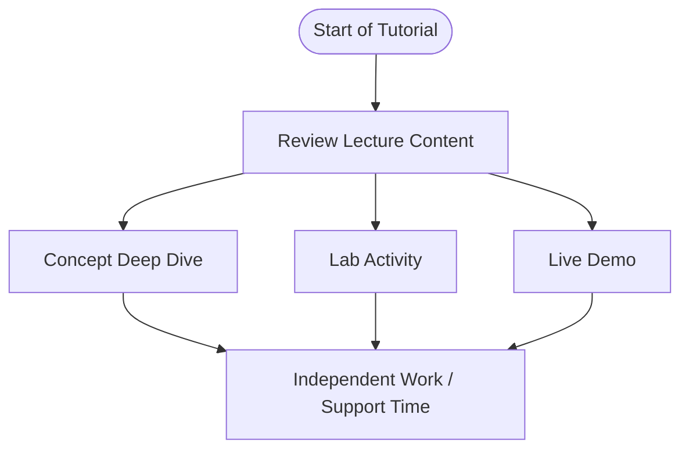

# INFR 2350U 
### Intermediate Computer Graphics

### Tutorial 1 (introduction)
### We will begin shortly.
#### Tutorial Presented by Constantine Pallas

---
# So... who is this guy? 
<split even gap=3>
![[Pasted image 20250910211644.png|500]]
- ## Constantine Lucius Pallas <!-- element class="fragment" -->
- ## Current Masters CS Student <!-- element class="fragment" -->
- ## Recent Game Dev Grad <!-- element class="fragment" -->
- ## I have taken this course <!-- element class="fragment" -->
 -</split>
If you need to get ahold of me, you can message me on Canvas or Discord. I will likely respond quicker on Discord. <!-- element class="`fragment" -->

---
# Course Thesis

## Make games look great

---
# What does that mean?

<split even>
![[Pasted image 20260119011241.png | 300]]
![[Pasted image 20260119011359.png | 300]]
![[Pasted image 20260119011729.png | 300]]
</split>

## Visuals shape the identity of a game.   
## A game with a distinct visual identity is a recognizable game
 
---
# In this course, you will

### Learn a series of techniques that frequently contribute to the visual styles of successful games

### Practice utilizing these techniques to create visually interesting scenes

### Become, to a greater degree, able to develop unique visual styles for your games - GDW and otherwise

---
# On the agenda for this week

## Introduction to the lab

## A look forward at Lab Assignments

---

# Introduction to the lab

## Goal: provide praxis (application to theory)

## Participating in the lab content will help you to develop experience

---
# Tools
## We will use specific software during the labs. You can use whichever software you prefer, but I will be able to provide greater assistance if you closely follow my setup.

## Lab assignments (similar to lecture assignments) may require the use of specific software.

## Engine: Unity 6.3 LTS (6000.3.4f1)
### Unless otherwise stated, all demo projects will use the Universal Render Pipeline (URP)
## Source Control: GitHub
## 2D Image Editor: Aseprite (LibreSprite is a free alternitive)
## 3D Editor: Blender (Latest version via Steam)

---
# Quick Content Recap
### Baseline knowledge for this course
### If you need a refresher, that's ok! I'm happy to recommend resources or answer questions
---
# 1. The rendering pipeline
### You should be familiar with what each of the basic steps does
### You should know the meaning of relevant terms such as vertices, fragments, and rasterization. 
### You should know what a shader is / does.
![[Pasted image 20260119021615.png]]

---
# 2. Shader Development

### You should have some experience developing and applying basic shaders. 
### You should be able to apply a material with a custom shader to a model in-engine.

![[Pasted image 20260119022209.png]]

---
# 3. 3D Basics
## You should have some experience editing 3D models, and using them in-engine.

## You should know the meaning of relevant terms such as vertices, faces, and normals. 

## (For these labs, you will not need to be adept in 3D editor such as blender, but it can be helpful.)
![[Pasted image 20260119022631.png | 300]]

---
# Look forward at Lab Assignment 1

## Will be assigned next week

## Will focus on cameras and scene composition

---

# Independent Work Time / Q&A Period

## Thank you for coming to the lab, be good to each other!